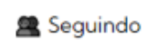
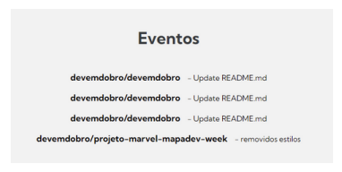
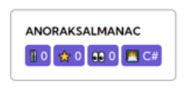

# Desafio API GitHub
Realização de 3 solicitações adicionais ao [projeto do código base](https://github.com/AmandaMeneghini/projeto-inicial-fetch-github-api.git), utilizando a [API do GitHub](https://docs.github.com/pt/rest/users/users?apiVersion=2022-11-28#get-a-user)

## Solicitações

1.Adicionar quantidade de seguidores e pessoas que o usuário segue;




2.Adicionar eventos e mensagens dos eventos commitados pelo usuário;




3.Incrementar quantidade de **🍴forks, ⭐stars, 👀watchers e 👨‍💻linguagem** para cada repositório.



<br>
<br>

# Minha Resolução 👩‍💻


**[Clique aqui](https://amandameneghini.github.io/desafio-api-github/) para visualizar**

### Tecnologias Utilizadas 🛠

<div style="display: flex">
    
    
    
</div>

### Extensões Utilizadas 🎨


**Extenção** para auxiliar na criação da responsividade do Chrome Web Store "[Responsive Viewer](https://chromewebstore.google.com/detail/responsive-viewer/inmopeiepgfljkpkidclfgbgbmfcennb)" 

## Como utiliza 🤔

1. Crie uma pasta em que deseja clonar o repositório.

2. Com o botão dirteito do mouse selecione a opção "Git Bash HERE"

3. Clone o projeto (no prompt do Git Bash):

```
https://github.com/AmandaMeneghini/desafio-api-github.git
```

4. Acesse a pasta do projeto:

```
cd desafio-api-github
```

5. Abra o código no VS Code:

```
code .
```

Passos extras com a extensão **Live Server** no **VS Code**:

6. Vá no VS Code em extenções e baixe a extenção "Live Server"

7. Precione a tecla **"Alt"** depois aperte e solte **"L"** e **"O"**, para a visualização do projeto; ou se preferir clique em **"Go Live"** (lado inferior direito)